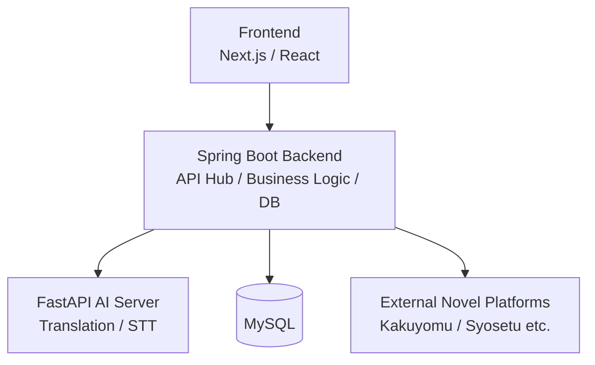

# TranslaCat Backend

> Web小説翻訳、音声翻訳、認証、データ永続化を担う Spring Boot ベースの API Hub

## 1. 概要

TranslaCat Backend は、TranslaCat プラットフォームにおける中核 API サーバです。  
フロントエンドからのリクエストを受け取り、認証、業務ロジック、DB 保存、外部サイト連携、AI サーバ連携を統括します。

本リポジトリは、単なる CRUD バックエンドではなく、以下の責務を持つ **オーケストレーション層** として設計されています。

- ユーザー認証および認可
- Web 小説系機能の提供
- 外部小説サイトのスクレイピング連携
- 翻訳対象データの整形と保存
- FastAPI AI Server との内部 API 連携
- 一部翻訳フローにおける Gemini 直接呼び出し
- 音声翻訳結果の保存
- 直近閲覧情報や辞書情報の管理

---

## 2. このプロジェクトで実現したいこと

TranslaCat は、単にテキストを翻訳するだけのサービスではありません。  
異なる言語で作られたコンテンツを、ユーザーがもっと自然に、もっと継続的に楽しめるようにすることを目指しています。

Backend はその中で、以下を支える役割を担います。

- 小説プラットフォームごとの差異を吸収すること
- ユーザーが扱いやすい API に変換して返すこと
- AI 処理をサービスとして再利用しやすい形にまとめること
- 翻訳だけで終わらず、閲覧履歴や辞書など体験全体を支えること

---

## 3. 全体アーキテクチャにおける位置づけ



Backend は、フロントエンド・DB・外部小説サイト・AI Server の間をつなぐ中心ノードです。  
認証、保存、エラーハンドリング、再試行、外部連携の制御をまとめて担っています。

---

## 4. 主な機能

### 4-1. 認証 / ユーザー管理

- メールアドレスによるユーザー登録
- メールアドレス + パスワードによるログイン
- Google ソーシャルログイン
- JWT ベースのアクセストークン / リフレッシュトークン運用
- ログアウト

### 4-2. 小説プラットフォーム機能

- 対応プラットフォーム一覧取得
- プラットフォーム別ジャンル一覧取得
- ランキング集計期間一覧取得
- ランキング作品一覧取得
- キーワード検索
- 小説詳細 / エピソード一覧取得
- 単話 / 短編の翻訳済み本文取得

### 4-3. 翻訳支援機能

- AI Server 連携によるバッチ翻訳
- 一部フローにおける Gemini 直接呼び出し
- 辞書登録による日本語補助情報の管理
- 音声翻訳結果の保存

### 4-4. UX 支援機能

- 最近見た作品 / エピソードの保存
- 最近見た項目の削除
- 最近見た項目の上位取得

---

## 5. 技術スタック

| 区分 | 採用技術 |
|---|---|
| Language | Java 21 |
| Framework | Spring Boot 3.5.7 |
| Security | Spring Security, JWT, OAuth2 |
| ORM / Query | Spring Data JPA, QueryDSL |
| Database | MySQL |
| AI Integration | Spring AI (Google GenAI / Gemini), Internal FastAPI API |
| HTTP Client | WebClient / WebFlux |
| Resilience | Resilience4j |
| Scraping | Jsoup |
| Documentation | Swagger / OpenAPI |
| Build Tool | Gradle |
| NLP Utility | Kuromoji, Sudachi |

---

## 6. このリポジトリの見どころ

### 6-1. API サーバでありながら、単なる CRUD に閉じていない

本サーバは、ユーザーや小説情報を保存するだけではなく、外部サイトからの取得、翻訳処理の振り分け、AI サーバとの連携など、複数責務をオーケストレーションしています。

### 6-2. AI 処理を Backend から分離しつつ、ビジネスロジックは Backend に残している

翻訳モデルや STT のような計算負荷・AI 依存が強い処理は FastAPI 側に分けています。  
一方で、ユーザー情報や閲覧履歴、ドメインルールは Spring Boot 側に保持し、責務分離を明確にしています。

### 6-3. 小説サイト差分を Backend 側で吸収する構造

対応プラットフォームが増えても、フロントエンドがプラットフォーム固有実装を意識しなくてよいように、Backend が API 形状を統一する役割を担っています。

---

## 7. API 一覧

### 7-1. Health Check

| Method | Path | 概要 |
|---|---|---|
| GET | `/api/v1/health` | サーバ生存確認 |

### 7-2. 認証 API

| Method | Path | 概要 |
|---|---|---|
| POST | `/api/v1/auth/register` | ユーザー登録 |
| POST | `/api/v1/auth/login` | ログイン |
| POST | `/api/v1/auth/social/{provider}` | ソーシャルログイン |
| POST | `/api/v1/auth/logout` | ログアウト |
| POST | `/api/v1/auth/token/refresh` | アクセストークン再発行 |

### 7-3. プラットフォーム / 小説 API

| Method | Path | 概要 |
|---|---|---|
| GET | `/api/v1/platforms` | プラットフォーム一覧 |
| GET | `/api/v1/{platformCode}/genres` | ジャンル一覧 |
| GET | `/api/v1/{platformCode}/ranking/periods` | ランキング期間一覧 |
| GET | `/api/v1/{platformCode}/ranking/novels/{period}/{genreId}` | ランキング作品一覧 |
| GET | `/api/v1/{platformCode}/search/novels` | 作品検索 |
| GET | `/api/v1/{platformCode}/novels/{novelId}` | 作品詳細 / エピソード一覧 |
| GET | `/api/v1/{platformCode}/{novelIdentifier}/episodes` | 短編本文取得 |
| GET | `/api/v1/{platformCode}/{novelIdentifier}/episodes/{episodeId}` | 話数本文取得 |

### 7-4. 補助 API

| Method | Path | 概要 |
|---|---|---|
| POST | `/api/v1/dictionary/register` | 辞書登録 |
| POST | `/api/v1/voice/translate` | 音声翻訳結果の翻訳 / 保存 |
| GET | `/api/v1/recent/top10` | 最近見た項目取得 |
| POST | `/api/v1/recent/save` | 最近見た項目保存 |
| DELETE | `/api/v1/recent/{recentViewId}` | 最近見た項目削除 |

---

## 8. 実装上の設計ポイント

### 8-1. Spring Boot は API Hub として振る舞う

フロントエンドは原則としてこの Backend にのみアクセスします。  
Backend はリクエストを受けて、必要に応じて DB・外部小説サイト・AI Server へアクセスし、最終的なレスポンスを整形して返します。

### 8-2. AI 呼び出しは 2 系統ある

現在のコードベースでは、翻訳処理は以下の 2 系統があります。

- FastAPI AI Server を内部 API として呼び出す経路
- Spring Boot から Gemini を直接呼び出す経路

この構成により、機能ごとに最適な呼び出し方式を使える一方で、将来的には統一方針を決める余地もあります。

### 8-3. 外部小説サイト連携を前提とした構造

外部小説サイトは自社管理の API ではないため、レスポンス変化や遅延、失敗を前提に設計する必要があります。  
そのため、Resilience4j を用いた再試行・サーキットブレーカ設定が導入されています。

---

## 9. ローカル実行方法

### 9-1. ビルド

```bash
./gradlew clean build
```

### 9-2. アプリケーション起動

```bash
./gradlew bootRun
```

IDE から起動する場合のメインクラス:

```text
jp.co.translacat.TranslacatApplication
```

---

## 10. 環境変数 / 設定値

`application-prod.properties` から確認できる主要項目は以下の通りです。

| 項目 | 用途 |
|---|---|
| `DB_URL` | MySQL 接続 URL |
| `DB_USERNAME` | DB ユーザー名 |
| `DB_PASSWORD` | DB パスワード |
| `GOOGLE_CLIENT_ID` | Google OAuth クライアント ID |
| `FRONTEND_URL` | CORS 許可対象フロント URL |
| `GEMINI_API_KEY` | Gemini 利用 API Key |
| `GOOGLE_PROXY_URL` | Google Proxy URL |
| `AI_SERVER_URL` | FastAPI AI Server URL |
| `AI_SERVER_API_KEY` | AI Server 呼び出し用 API Key |
| `JWT_SECRET_KEY` | JWT 署名キー |

---

## 11. Swagger

ローカル起動後、以下で API 一覧を確認できます。

```text
http://localhost:8080/swagger-ui/index.html
```

---

## 12. ディレクトリ構成

```text
src/main/java/jp/co/translacat
├─ domain
│  ├─ novel
│  │  ├─ dictionary
│  │  ├─ episode
│  │  ├─ genre
│  │  ├─ novel
│  │  ├─ platform
│  │  ├─ ranking
│  │  └─ search
│  ├─ user
│  └─ voice
├─ global
│  ├─ config
│  ├─ controller
│  ├─ dto
│  ├─ exception
│  ├─ logging
│  ├─ security
│  └─ utils
└─ infrastructure
   ├─ client
   │  ├─ ai
   │  └─ legacy
   ├─ japanese
   └─ scraping
```

---

## 13. セットアップ時の注意点

- DB 接続情報が未設定の場合、アプリケーションは正常起動できません。
- `AI_SERVER_URL` および `AI_SERVER_API_KEY` が正しく設定されていない場合、AI 連携機能は利用できません。
- `JWT_SECRET_KEY` が未設定の場合、認証系機能は成立しません。
- `system_full.dic` は Git LFS 管理前提のため、環境によっては別途取得が必要です。
- 外部サイト連携は対象サイトの HTML / 構造変更の影響を受けます。

---

## 14. この README をさらに発展させるなら

- 主要 API の Request / Response サンプル追加
- ERD 追加
- スクレイピング〜翻訳〜保存までのシーケンス図追加
- Docker / デプロイ手順追加
- エラーコード設計方針追加

---

## 15. まとめ

TranslaCat Backend は、認証、業務ロジック、データ保存、外部連携、AI 呼び出しを束ねる **プラットフォームの中核サーバ** です。  
単なる API 集約ではなく、コンテンツ翻訳体験全体を支えるオーケストレーション層として機能しています。
