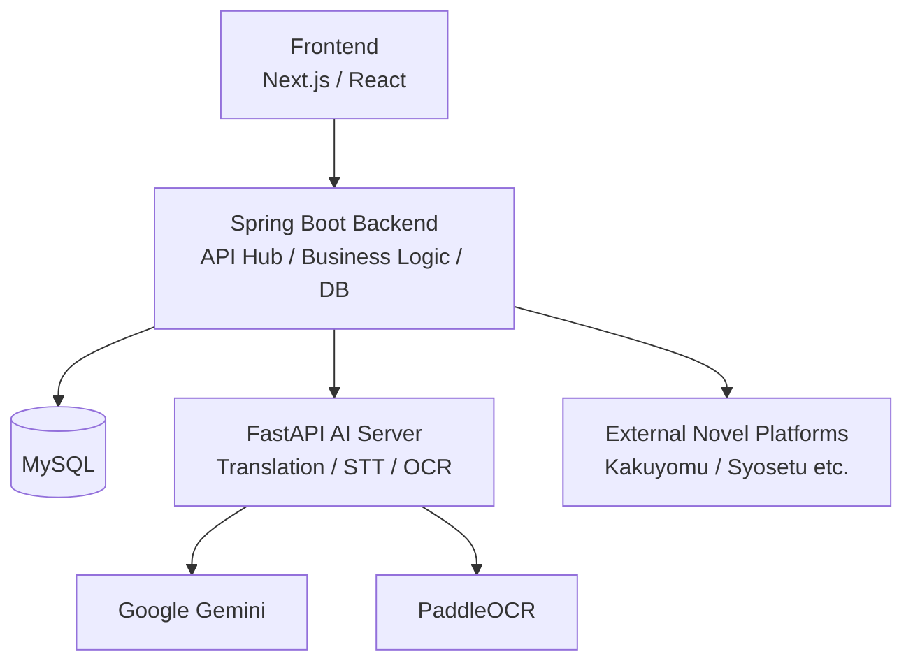
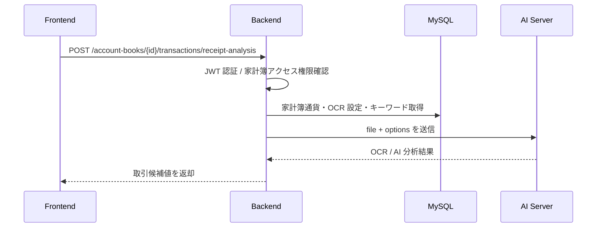

# TranslaCat Backend

> Web小説翻訳、音声翻訳、家計簿、認証、データ永続化、AI 連携を担う Spring Boot ベースの API Hub

## 1. 概要

TranslaCat Backend は、TranslaCat プラットフォームにおける中核 API サーバです。
Frontend からのリクエストを受け取り、認証、業務ロジック、DB 保存、外部サイト連携、AI Server 連携を統括します。

本リポジトリは、単なる CRUD バックエンドではなく、以下の責務を持つオーケストレーション層として設計されています。

- ユーザー認証および認可
- Google ソーシャルログイン連携
- Web 小説系機能の提供
- 外部小説サイトのスクレイピング連携
- 翻訳対象データの整形と保存
- FastAPI AI Server との内部 API 連携
- 一部翻訳フローにおける Gemini 直接呼び出し
- 音声翻訳結果の保存
- 直近閲覧情報や辞書情報の管理
- 家計簿データの管理
- AI レシート分析の業務フロー制御

---

## 2. このプロジェクトで実現したいこと

TranslaCat は、単にテキストを翻訳するだけのサービスではありません。
異なる言語で作られたコンテンツを、ユーザーがもっと自然に、もっと継続的に楽しめるようにすることを目指しています。

Backend はその中で、以下を支える役割を担います。

- 小説プラットフォームごとの差異を吸収すること
- ユーザーが扱いやすい API に変換して返すこと
- AI 処理をサービスとして再利用しやすい形にまとめること
- 翻訳だけで終わらず、閲覧履歴や辞書など体験全体を支えること
- 家計簿のような日常利用機能も同じ認証・権限基盤で扱うこと

---

## 3. 全体アーキテクチャにおける位置づけ



Backend は、Frontend・DB・外部小説サイト・AI Server の間をつなぐ中心ノードです。
認証、保存、エラーハンドリング、再試行、外部連携の制御をまとめて担います。

AI Server は AI モデル依存処理を担当しますが、ユーザー認証、家計簿権限、DB 設定値、保存判断などのビジネスロジックは Backend 側に残します。

---

## 4. 主な機能

### 4-1. 認証 / ユーザー管理

- メールアドレスによるユーザー登録
- メールアドレス + パスワードによるログイン
- Google ソーシャルログイン
- JWT ベースのアクセストークン / リフレッシュトークン運用
- ログアウト
- ユーザー公開 ID による識別

### 4-2. 小説プラットフォーム機能

- 対応プラットフォーム一覧取得
- プラットフォーム別ジャンル一覧取得
- ランキング集計期間一覧取得
- ランキング作品一覧取得
- キーワード検索
- 小説詳細 / エピソード一覧取得
- 単話 / 短編の翻訳済み本文取得

### 4-3. 翻訳支援機能

- AI Server 連携によるバッチ翻訳
- 一部フローにおける Gemini 直接呼び出し
- 辞書登録による日本語補助情報の管理
- 音声翻訳結果の保存

### 4-4. UX 支援機能

- 最近見た作品 / エピソードの保存
- 最近見た項目の削除
- 最近見た項目の上位取得

### 4-5. 家計簿機能

- 家計簿作成 / 一覧 / 詳細 / 更新 / 削除
- 家計簿ごとの基準通貨設定
- 家計簿カテゴリ管理
- 家計簿メンバー管理
- 取引登録 / 更新 / 削除
- 取引一覧検索 / ページング
- 店舗名候補取得
- 月別取引対象年月一覧
- 月別目標金額
- 固定費管理
- 固定費からの取引生成
- 月別支出チャート
- カテゴリ別 / 店舗別支出ランキング
- AI レシート分析連携

---

## 5. 技術スタック

| 区分 | 採用技術 |
|---|---|
| Language | Java 21 |
| Framework | Spring Boot 3.5.x |
| Security | Spring Security, JWT, OAuth2 |
| ORM / Query | Spring Data JPA, QueryDSL |
| Database | MySQL |
| AI Integration | Spring AI, Google Gemini, Internal FastAPI API |
| HTTP Client | WebClient / WebFlux |
| Resilience | Resilience4j |
| Scraping | Jsoup |
| Documentation | Swagger / OpenAPI |
| Build Tool | Gradle |
| NLP Utility | Kuromoji, Sudachi |

---

## 6. このリポジトリの見どころ

### 6-1. API サーバでありながら、単なる CRUD に閉じていない

本サーバは、ユーザーや小説情報を保存するだけではなく、外部サイトからの取得、翻訳処理の振り分け、AI Server との連携など、複数責務をオーケストレーションしています。

### 6-2. AI 処理を Backend から分離しつつ、ビジネスロジックは Backend に残している

翻訳、STT、OCR のような AI 依存が強い処理は FastAPI 側に分離しています。
一方で、ユーザー情報、家計簿アクセス権限、DB による OCR 設定、最終保存判断は Backend 側に保持し、責務分離を明確にしています。

### 6-3. 小説サイト差分を Backend 側で吸収する構造

対応プラットフォームが増えても、Frontend がプラットフォーム固有実装を意識しなくてよいように、Backend が API 形状を統一します。

### 6-4. 家計簿でも同じ認証・権限基盤を再利用

家計簿機能は既存のユーザー認証基盤と統合されており、家計簿ごとのアクセス権限を Backend で検証します。

---

## 7. 家計簿ドメイン設計

家計簿は `domain/accountbook` 配下で管理します。

主な領域:

- `accountbook`: 家計簿本体
- `category`: 家計簿カテゴリ
- `transaction`: 収入 / 支出取引
- `monthlygoal`: 月別目標金額
- `fixedcost`: 固定費
- `member`: 家計簿メンバー
- `receiptkeyword`: レシート分析用 OCR 設定 / キーワード

家計簿ごとに基準通貨を持ち、取引金額はその通貨基準で保存します。

---

## 8. AI レシート分析連携

レシート分析は、Frontend から画像を受け取った Backend が権限確認と設定値解決を行い、AI Server を呼び出す構成です。



Frontend は分析結果を入力フォームに反映し、ユーザーが内容を確認してから通常の取引登録 API で保存します。

### 8-1. OCR 設定

`receipt_ocr_setting` で通貨コードと OCR 言語を紐づけます。

例:

| currency_code | ocr_language |
|---|---|
| JPY | japan |
| KRW | korean |
| USD | en |

### 8-2. レシート分析キーワード

`receipt_keyword` で OCR テキスト圧縮や商品名候補除外のためのキーワードを管理します。

| keyword_type | 用途 |
|---|---|
| `STOP_AFTER` | 以降の OCR 行を分析対象から除外する |
| `IMPORTANT` | 合計・金額・日付など重要行を保持する |
| `EXCLUDE_ITEM` | 広告・案内文など商品名候補から除外する |

この設計により、AI Server を変更せずに DB データだけでキーワードを調整できます。

---

## 9. API 一覧

### 9-1. Health Check

| Method | Path | 概要 |
|---|---|---|
| GET | `/api/v1/health` | サーバ生存確認 |

### 9-2. 認証 API

| Method | Path | 概要 |
|---|---|---|
| POST | `/api/v1/auth/register` | ユーザー登録 |
| POST | `/api/v1/auth/login` | ログイン |
| POST | `/api/v1/auth/social/{provider}` | ソーシャルログイン |
| POST | `/api/v1/auth/logout` | ログアウト |
| POST | `/api/v1/auth/token/refresh` | アクセストークン再発行 |

### 9-3. プラットフォーム / 小説 API

| Method | Path | 概要 |
|---|---|---|
| GET | `/api/v1/platforms` | プラットフォーム一覧 |
| GET | `/api/v1/{platformCode}/genres` | ジャンル一覧 |
| GET | `/api/v1/{platformCode}/ranking/periods` | ランキング期間一覧 |
| GET | `/api/v1/{platformCode}/ranking/novels/{period}/{genreId}` | ランキング作品一覧 |
| GET | `/api/v1/{platformCode}/search/novels` | 作品検索 |
| GET | `/api/v1/{platformCode}/novels/{novelId}` | 作品詳細 / エピソード一覧 |
| GET | `/api/v1/{platformCode}/{novelIdentifier}/episodes` | 短編本文取得 |
| GET | `/api/v1/{platformCode}/{novelIdentifier}/episodes/{episodeId}` | 話数本文取得 |

### 9-4. 補助 API

| Method | Path | 概要 |
|---|---|---|
| POST | `/api/v1/dictionary/register` | 辞書登録 |
| POST | `/api/v1/voice/translate` | 音声翻訳結果の翻訳 / 保存 |
| GET | `/api/v1/recent/top10` | 最近見た項目取得 |
| POST | `/api/v1/recent/save` | 最近見た項目保存 |
| DELETE | `/api/v1/recent/{recentViewId}` | 最近見た項目削除 |

### 9-5. 家計簿 API

| Method | Path | 概要 |
|---|---|---|
| GET | `/api/v1/account-books` | 家計簿一覧 |
| POST | `/api/v1/account-books` | 家計簿作成 |
| GET | `/api/v1/account-books/{accountBookId}` | 家計簿詳細 |
| PUT | `/api/v1/account-books/{accountBookId}` | 家計簿更新 |
| DELETE | `/api/v1/account-books/{accountBookId}` | 家計簿削除 |
| GET | `/api/v1/account-books/{accountBookId}/summary` | 家計簿サマリー |
| POST | `/api/v1/account-books/{accountBookId}/transactions` | 取引一覧 |
| POST | `/api/v1/account-books/{accountBookId}/transactions/register` | 取引登録 |
| PUT | `/api/v1/account-books/{accountBookId}/transactions/{transactionId}` | 取引更新 |
| DELETE | `/api/v1/account-books/{accountBookId}/transactions/{transactionId}` | 取引削除 |
| GET | `/api/v1/account-books/{accountBookId}/transactions/months` | 取引対象年月一覧 |
| GET | `/api/v1/account-books/{accountBookId}/transactions/stores/suggestions` | 店舗名候補 |
| POST | `/api/v1/account-books/{accountBookId}/transactions/receipt-analysis` | レシート分析 |

---

## 10. 実装上の設計ポイント

### 10-1. Spring Boot は API Hub として振る舞う

Frontend は原則として Backend のみを呼び出します。
Backend はリクエストを受け、DB・外部小説サイト・AI Server へ必要な処理を振り分け、最終的なレスポンスを整形します。

### 10-2. QueryDSL による検索処理

複雑な検索や動的条件を扱う箇所では QueryDSL を利用します。
家計簿取引一覧やレシート分析キーワードの有効候補取得でも、Repository Custom / Impl の構成を採用します。

### 10-3. Facade / QueryService の分離

ユースケース組み立ては Facade、読み取り専用の問い合わせは QueryService に寄せる方針です。

例:

```text
Controller
→ AccountBookReceiptAnalysisFacade
   → AccountBookAccessService
   → ReceiptAnalysisOptionQueryService
   → AiServerClient
```

---

## 11. ローカル実行方法

### 11-1. ビルド

```bash
./gradlew clean build
```

Windows:

```powershell
.\gradlew clean build
```

### 11-2. アプリケーション起動

```bash
./gradlew bootRun
```

Windows:

```powershell
.\gradlew bootRun
```

IDE から起動する場合のメインクラス:

```text
jp.co.translacat.TranslacatApplication
```

---

## 12. 環境変数 / 設定値

代表的な設定値は以下です。

| 項目 | 用途 |
|---|---|
| `DB_URL` | MySQL 接続 URL |
| `DB_USERNAME` | DB ユーザー名 |
| `DB_PASSWORD` | DB パスワード |
| `GOOGLE_CLIENT_ID` | Google OAuth クライアント ID |
| `FRONTEND_URL` | CORS 許可対象 Frontend URL |
| `GEMINI_API_KEY` | Gemini 利用 API Key |
| `GOOGLE_PROXY_URL` | Google Proxy URL |
| `AI_SERVER_URL` | FastAPI AI Server URL |
| `AI_SERVER_API_KEY` | AI Server 呼び出し用 API Key |
| `JWT_SECRET_KEY` | JWT 署名キー |

レシート画像を扱うため、multipart 制限も明示的に設定します。

```yaml
spring:
  servlet:
    multipart:
      max-file-size: 6MB
      max-request-size: 7MB
```

開発中に大きな画像を使う場合は、必要に応じて 10MB / 12MB 程度へ調整できます。

---

## 13. Swagger

ローカル起動後、以下で API 一覧を確認できます。

```text
http://localhost:8080/swagger-ui/index.html
```

---

## 14. ディレクトリ構成

```text
src/main/java/jp/co/translacat
├─ domain
│  ├─ accountbook
│  │  ├─ accountbook
│  │  ├─ category
│  │  ├─ fixedcost
│  │  ├─ member
│  │  ├─ monthlygoal
│  │  ├─ receiptkeyword
│  │  └─ transaction
│  ├─ novel
│  │  ├─ dictionary
│  │  ├─ episode
│  │  ├─ genre
│  │  ├─ novel
│  │  ├─ platform
│  │  ├─ ranking
│  │  └─ search
│  ├─ user
│  └─ voice
├─ global
│  ├─ config
│  ├─ controller
│  ├─ dto
│  ├─ exception
│  ├─ logging
│  ├─ security
│  └─ utils
└─ infrastructure
   ├─ client
   │  ├─ ai
   │  └─ legacy
   ├─ japanese
   └─ scraping
```

---

## 15. セットアップ時の注意点

- DB 接続情報が未設定の場合、アプリケーションは正常起動できません。
- `AI_SERVER_URL` および `AI_SERVER_API_KEY` が正しく設定されていない場合、AI 連携機能は利用できません。
- `JWT_SECRET_KEY` が未設定の場合、認証系機能は成立しません。
- `system_full.dic` は Git LFS 管理前提のため、環境によっては別途取得が必要です。
- 外部サイト連携は対象サイトの HTML / 構造変更の影響を受けます。
- レシート分析は AI Server の OCR / Gemini 応答品質に影響を受けるため、最終的な取引登録前にユーザー確認を行います。

---

## 16. まとめ

TranslaCat Backend は、認証、業務ロジック、データ保存、外部連携、AI 呼び出しを束ねるプラットフォームの中核サーバです。
Web 小説翻訳体験を支えるだけでなく、家計簿のような日常利用機能も同じ認証・権限・AI 連携基盤の上で扱える構成になっています。
