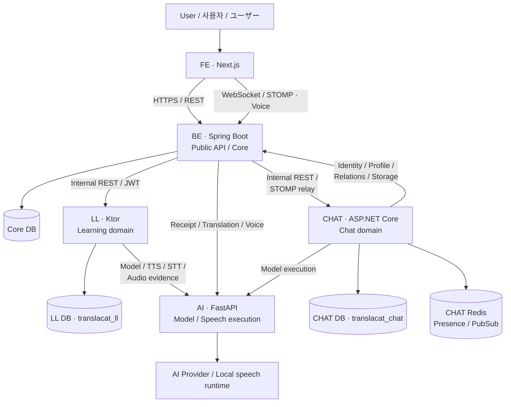
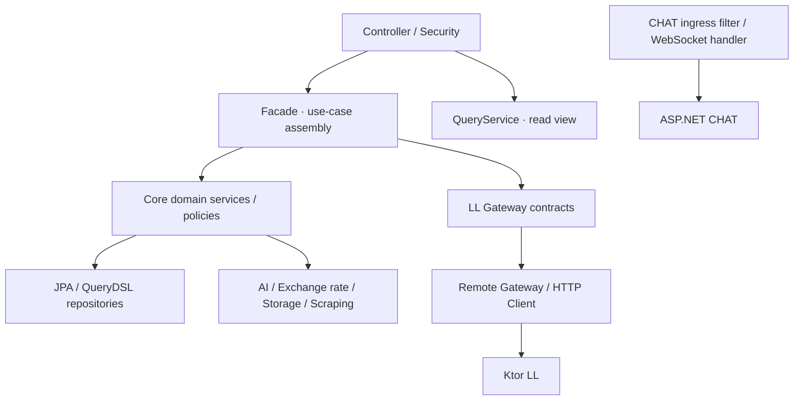
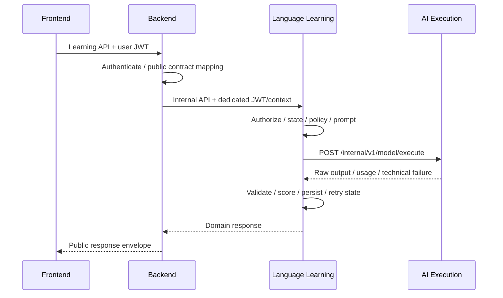
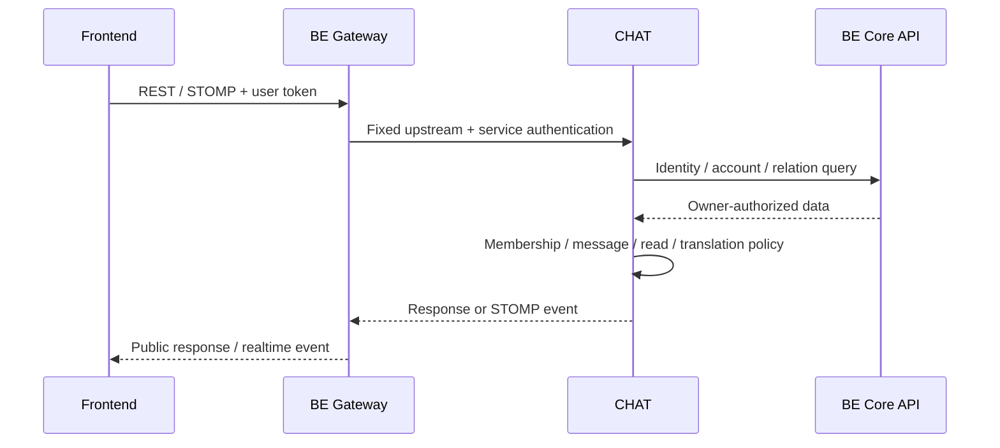
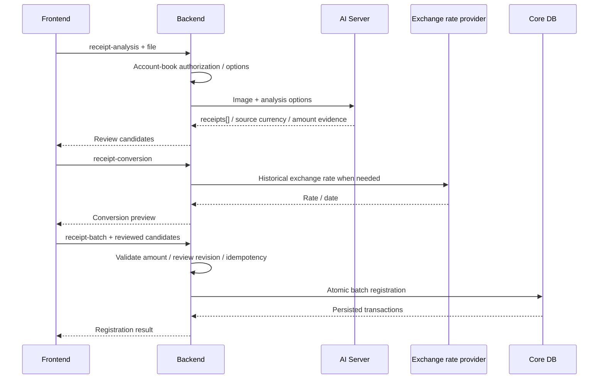

# TranslaCat Backend

> 공통 인증·가계부·소설·Voice Gateway와 LL/CHAT 공개 API 중계를 담당하는 Spring Boot Backend  
> 共通認証・家計簿・小説・Voice GatewayとLL/CHAT公開API中継を担うSpring Boot Backend

TranslaCat의 FE / BE / AI / CHAT / LL 분리 구조를 설명하는 저장소 안내서입니다. 기술 버전과 경로는 2026-09-27 제공 소스 기준이며, 실행 환경의 실제 배포 상태나 테스트 통과를 의미하지 않습니다.  
TranslaCatのFE / BE / AI / CHAT / LL分離構成を説明するリポジトリガイドです。技術バージョンとパスは2026-09-27提供ソースを基準とし、実環境でのデプロイ状態やテスト成功を示すものではありません。

[개요 / 概要](#overview) · [책임 / 責務](#ownership) · [구조 / 構成](#architecture) · [실행 / 起動](#setup) · [설정 / 設定](#configuration) · [테스트 / テスト](#tests)

---

<a id="overview"></a>

## 1. 개요 / 概要

TranslaCat Backend는 Frontend의 주요 진입점이자 공통 업무 서버입니다. 사용자 인증과 계정·친구·차단, 가계부, 관리자 소설 기능, 음성 번역 세션을 소유하며, 언어학습과 채팅은 각각 LL과 CHAT의 API로 연결합니다.  
TranslaCat BackendはFrontendの主要入口であり、共通業務サーバーです。ユーザー認証とアカウント・友達・ブロック、家計簿、管理者向け小説機能、音声翻訳セッションを所有し、言語学習とチャットはそれぞれLLとCHATのAPIへ接続します。

따라서 현재 BE는 모든 도메인 로직이 모인 단일 서버도, 업무 로직이 전혀 없는 순수 reverse proxy도 아닙니다. 공통·잔존 도메인은 직접 처리하고, 분리된 도메인은 외부 계약과 인증·중계 경계를 유지합니다.  
そのため現在のBEは、全ドメインロジックを集約する単一サーバーでも、業務ロジックを持たない純粋なreverse proxyでもありません。共通・残存ドメインは直接処理し、分離済みドメインについては公開契約と認証・中継境界を維持します。

---

<a id="ownership"></a>

## 2. 서비스 책임과 경계 / サービス責務と境界

| 서비스 / サービス | 현재 책임 / 現在の責務 | 연결 기준 / 接続方針 |
| --- | --- | --- |
| FE | 화면·입력·세션·실시간 표시<br/>画面・入力・セッション・リアルタイム表示 | 최종 권한·채점·DB 저장 정책은 서버가 판정<br/>最終的な認可・採点・DB保存方針はサーバーが判定 |
| BE | 사용자 인증·공통 계정·친구/차단·가계부·소설·Voice Gateway·서비스 중계<br/>ユーザー認証・共通アカウント・友達/ブロック・家計簿・小説・Voice Gateway・サービス中継 | LL/CHAT의 업무 판단을 다시 구현하지 않음<br/>LL/CHATの業務判断を再実装しない |
| LL | 학습 설정·문제·답안·평가·난이도·성장·학습 음성 저장<br/>学習設定・問題・回答・評価・難易度・成長・学習音声保存 | 모델 SDK·음성 추론 실행은 AI 호출<br/>モデルSDK・音声推論の実行はAIを呼び出す |
| CHAT | 방·멤버·메시지·읽음·번역 정책·AI 대화·Presence<br/>ルーム・メンバー・メッセージ・既読・翻訳方針・AI会話・Presence | 공통 계정·관계·공통 스토리지는 BE 내부 API 이용<br/>共通アカウント・関係・共通ストレージはBE内部APIを利用 |
| AI | 범용 모델 실행·TTS/STT·Voice pipeline·영수증 분석·일반 번역<br/>汎用モデル実行・TTS/STT・Voice pipeline・レシート分析・一般翻訳 | LL/CHAT의 장기 상태·업무 프롬프트·최종 정책을 소유하지 않음<br/>LL/CHATの長期状態・業務プロンプト・最終方針を所有しない |

`domain/languagelearning`에 Controller·DTO·Facade·Gateway 계약이 남아 있다는 사실과, 학습 문제 생성·평가 정책을 BE가 실행한다는 것은 다릅니다. 실제 경계는 Facade에서 `infrastructure/languagelearning`의 Remote Gateway와 내부 Client로 이어지는 호출을 기준으로 읽습니다.  
`domain/languagelearning`にController・DTO・Facade・Gateway契約が残っていることと、BEが学習問題生成・評価方針を実行することは別です。実際の境界はFacadeから`infrastructure/languagelearning`のRemote Gatewayと内部Clientへ続く呼び出しを基準に読みます。

CHAT의 방·메시지·읽음·Presence·번역·AI 대화 상태는 CHAT 책임입니다. BE가 계속 제공하는 계정·프로필·친구/차단 및 공통 객체 저장 API는 채팅 전용 업무 엔진의 복제가 아니라 공통 데이터 소유자 경계입니다.  
CHATのルーム・メッセージ・既読・Presence・翻訳・AI会話状態はCHATの責務です。BEが引き続き提供するアカウント・プロフィール・友達/ブロックと共通オブジェクト保存APIは、チャット専用業務エンジンの複製ではなく共通データ所有者の境界です。

**관련 소스 / 関連ソース:** [LL gateways](src/main/java/jp/co/translacat/infrastructure/languagelearning/gateway) · [CHAT gateway](src/main/java/jp/co/translacat/infrastructure/chat/gateway) · [CHAT Core API](src/main/java/jp/co/translacat/infrastructure/chat/core)

---

<a id="architecture"></a>

## 3. 전체 아키텍처 / 全体アーキテクチャ


```mermaid
flowchart TB
    U["User / 사용자 / ユーザー"] --> FE["FE · Next.js"]
    FE -->|"HTTPS / REST"| BE["BE · Spring Boot<br/>Public API / Core"]
    FE -->|"WebSocket / STOMP · Voice"| BE

    BE --> COREDB[("Core DB")]
    BE -->|"Internal REST / JWT"| LL["LL · Ktor<br/>Learning domain"]
    BE -->|"Receipt / Translation / Voice"| AI["AI · FastAPI<br/>Model / Speech execution"]
    BE -->|"Internal REST /<br/>STOMP relay"| CHAT["CHAT · ASP.NET Core<br/>Chat domain"]

    LL --> LLDB[("LL DB · translacat_ll")]
    LL -->|"Model / TTS / STT /<br/>Audio evidence"| AI
    CHAT -->|"Model execution"| AI
    CHAT --> CHATDB[("CHAT DB · translacat_chat")]
    CHAT --> REDIS[("CHAT Redis<br/>Presence / PubSub")]
    CHAT -->|"Identity / Profile /<br/>Relations / Storage"| BE
    AI --> PROVIDER["AI Provider / Local speech runtime"]
```

DB 상자는 데이터 책임과 논리 catalog를 나타냅니다. 이 그림만으로 서로 다른 물리 DB 서버·배포 호스트·고가용성 구성을 의미하지 않습니다. Storage 및 인증 공급자의 세부 연결은 각 기능 절에서 설명합니다.  
DBの箱はデータ責務と論理catalogを表します。この図だけで別々の物理DBサーバー・配置ホスト・高可用性構成を意味するものではありません。Storageと認証プロバイダーの詳細接続は各機能節で説明します。

BE→LL은 전용 내부 JWT, BE→CHAT은 ingress 전용 서비스 인증을 사용합니다. CHAT→BE는 반대 방향의 별도 인증이며, 사용자 JWT·LL 내부 키·CHAT 서비스 키를 하나의 공통 secret으로 합치지 않습니다.  
BE→LLは専用内部JWT、BE→CHATはingress専用サービス認証を使います。CHAT→BEは逆方向の別認証であり、ユーザーJWT・LL内部キー・CHATサービスキーを一つの共通secretへまとめません。

---

## 4. 기술 스택 / 技術スタック

| 구분 / 区分 | 선언된 기술 / 宣言された技術 |
| --- | --- |
| Language / Runtime | Java 21 · Gradle wrapper |
| Framework | Spring Boot 3.5.7 |
| Security | Spring Security · JJWT 0.13.0 · Google ID token validation |
| Persistence | Spring Data JPA · QueryDSL 5.0.0 · MySQL Connector/J |
| HTTP / Realtime | Spring MVC · WebClient/WebFlux · RestClient · JDK HttpClient · Spring WebSocket |
| Resilience | Resilience4j 2.3.0 · Spring Retry |
| OpenAPI | springdoc 2.8.13 |
| External content | Jsoup · Kuromoji · Sudachi |
| Storage | AWS SDK S3 2.46.21 · Local/S3-compatible adapters |
| AI integration | FastAPI 내부 API · Spring AI Google GenAI 의존성<br/>FastAPI内部API・Spring AI Google GenAI依存関係 |
| Verification | JUnit Platform · Spring Boot Test · Security Test · H2 · Testcontainers |

Spring AI / Google 관련 의존성과 설정은 BE에도 남아 있습니다. 이를 이유로 LL·CHAT의 새 업무 프롬프트가 BE에서 실행된다고 설명하거나, 반대로 모든 Provider 연동 코드가 AI에만 있다고 단정하지 않습니다.  
Spring AI / Google関連の依存関係と設定はBEにも残っています。これを理由にLL・CHATの新しい業務プロンプトをBEが実行すると説明したり、逆にすべてのProvider連携コードがAIだけにあると断定したりしません。

**관련 소스 / 関連ソース:** [Build manifest](build.gradle) · [Default properties](src/main/resources/application.properties)

---

## 5. 주요 업무 기능 / 主な業務機能

### 사용자·인증·관계 / ユーザー・認証・関係

이메일 가입/로그인, Google 소셜 로그인, access/refresh token, 로그아웃, 공개 사용자 식별자, 프로필·이미지, 친구 요청과 수락/거절/취소, 친구 목록, 사용자 검색과 차단을 처리합니다.  
メール登録/ログイン、Googleソーシャルログイン、access/refresh token、ログアウト、公開ユーザー識別子、プロフィール・画像、友達リクエストと承認/拒否/取消、友達一覧、ユーザー検索とブロックを処理します。

### 가계부 / 家計簿

가계부 본체·기준 통화·멤버와 초대·카테고리·수입/지출 거래·고정비와 거래 생성·월별 목표·요약·지출 차트 및 영수증 검토 등록을 소유합니다. 금액의 통화·정밀도·환율 검증과 최종 저장은 BE 업무입니다.  
家計簿本体・基準通貨・メンバーと招待・カテゴリ・収入/支出取引・固定費と取引生成・月別目標・サマリー・支出チャート・レシート確認登録を所有します。金額の通貨・精度・為替検証と最終保存はBEの業務です。

### 관리자 소설·번역 보조 / 管理者向け小説・翻訳補助

플랫폼·장르·랭킹·검색·소설·에피소드 조회, 외부 사이트 차이 흡수, 번역 결과·최근 열람·사전 정보를 다룹니다. 관련 URL은 SecurityConfig의 관리자 matcher로 보호하고, 비허용 접근에 대해 404로 숨기는 정책을 갖습니다.  
プラットフォーム・ジャンル・ランキング・検索・小説・エピソード取得、外部サイト差分の吸収、翻訳結果・最近の閲覧・辞書情報を扱います。関連URLはSecurityConfigの管理者matcherで保護し、許可されないアクセスを404で隠す方針を持ちます。

### Voice Translation V2 / Voice Translation V2

세션 생성·채널 ticket·WebSocket 오디오 중계·완료/재시도·최종 segment 이력과 사용량 정책을 관리합니다. VAD·STT·언어 감지·번역 실행은 AI의 Voice pipeline에 위임합니다. 예전 파일 업로드 API 설명만으로 현재 Voice 기능을 설명하지 않습니다.  
セッション作成・チャンネルticket・WebSocket音声中継・完了/再試行・最終segment履歴と利用量方針を管理します。VAD・STT・言語検出・翻訳実行はAIのVoice pipelineへ委譲します。旧ファイルアップロードAPIの説明だけで現在のVoice機能を説明しません。

**관련 소스 / 関連ソース:** [User domain](src/main/java/jp/co/translacat/domain/user) · [Account-book](src/main/java/jp/co/translacat/domain/accountbook) · [Novel](src/main/java/jp/co/translacat/domain/novel) · [Voice](src/main/java/jp/co/translacat/domain/voice) · [Security](src/main/java/jp/co/translacat/global/config/SecurityConfig.java)

---

## 6. 내부 계층과 도메인 구성 / 内部レイヤーとドメイン構成


```mermaid
flowchart TD
    C["Controller / Security"] --> F["Facade · use-case assembly"]
    C --> Q["QueryService · read view"]
    F --> CORE["Core domain services / policies"]
    CORE --> REPO["JPA / QueryDSL repositories"]
    F --> PORT["LL Gateway contracts"]
    PORT --> REMOTE["Remote Gateway / HTTP Client"]
    REMOTE --> LL["Ktor LL"]
    G["CHAT ingress filter / WebSocket handler"] --> CHAT["ASP.NET CHAT"]
    CORE --> EXT["AI / Exchange rate / Storage / Scraping"]
```

가계부는 `accountbook`, `category`, `transaction`, `monthlygoal`, `fixedcost`, `member`, `invitation`, `receiptkeyword` 등의 하위 영역으로 구성합니다. QueryDSL 검색, 접근권한 Service, 분석 Option 조회와 AI Client를 유스케이스별로 조립합니다.  
家計簿は`accountbook`、`category`、`transaction`、`monthlygoal`、`fixedcost`、`member`、`invitation`、`receiptkeyword`等の下位領域で構成します。QueryDSL検索、アクセス認可Service、分析Option取得とAI Clientをユースケースごとに組み立てます。

언어학습의 외부 응답 envelope와 사용자 principal은 BE 경계에 남고, 내부 서비스에는 필요한 사용자 context를 전달합니다. 저장소 안의 SQL·DTO·과거 설정 항목은 실행 경로와 구분해서 읽어야 합니다.  
言語学習の公開応答envelopeとユーザーprincipalはBE境界に残し、内部サービスへ必要なユーザーcontextを渡します。リポジトリ内のSQL・DTO・過去設定項目は実行経路と区別して読む必要があります。

---

## 7. LL·CHAT 요청 흐름 / LL・CHATリクエストフロー


```mermaid
sequenceDiagram
    participant FE as Frontend
    participant BE as Backend
    participant LL as Language Learning
    participant AI as AI Execution
    FE->>BE: Learning API + user JWT
    BE->>BE: Authenticate / public contract mapping
    BE->>LL: Internal API + dedicated JWT/context
    LL->>LL: Authorize / state / policy / prompt
    LL->>AI: POST /internal/v1/model/execute
    AI-->>LL: Raw output / usage / technical failure
    LL->>LL: Validate / score / persist / retry state
    LL-->>BE: Domain response
    BE-->>FE: Public response envelope
```

도식은 대표적인 모델 실행 경로입니다. 비동기 생성·평가에서는 작업 상태를 먼저 반환할 수 있고, 모든 공개 요청이 하나의 동기 AI 호출로 완료되는 것은 아닙니다.  
図は代表的なモデル実行経路です。非同期生成・評価ではジョブ状態を先に返す場合があり、すべての公開リクエストが一つの同期AI呼び出しで完了するわけではありません。


```mermaid
sequenceDiagram
    participant FE as Frontend
    participant BE as BE Gateway
    participant CHAT as CHAT
    participant CORE as BE Core API
    FE->>BE: REST / STOMP + user token
    BE->>CHAT: Fixed upstream + service authentication
    CHAT->>CORE: Identity / account / relation query
    CORE-->>CHAT: Owner-authorized data
    CHAT->>CHAT: Membership / message / read / translation policy
    CHAT-->>BE: Response or STOMP event
    BE-->>FE: Public response / realtime event
```

CHAT upstream은 운영자가 설정한 고정 origin이며 요청 Host나 redirect로 바꾸지 않습니다. Development의 loopback HTTP 외에는 HTTPS를 요구합니다. FE가 보낸 내부 서비스 인증 헤더를 신뢰하여 전달하는 구조가 아닙니다.  
CHAT upstreamは運用者が設定した固定originであり、リクエストHostやredirectで変更しません。Developmentのloopback HTTP以外ではHTTPSを要求します。FEが送った内部サービス認証ヘッダーを信頼して転送する構造ではありません。

**관련 소스 / 関連ソース:** [Fixed target](src/main/java/jp/co/translacat/infrastructure/chat/gateway/ChatGatewayTarget.java) · [WebSocket relay](src/main/java/jp/co/translacat/infrastructure/chat/gateway/ChatGatewayWebSocketHandler.java) · [Internal LL JWT](src/main/java/jp/co/translacat/infrastructure/languagelearning/client/security/LanguageLearningInternalJwtProvider.java)

---

## 8. 영수증 분석·환율·등록 / レシート分析・為替・登録


```mermaid
sequenceDiagram
    participant FE as Frontend
    participant BE as Backend
    participant AI as AI Server
    participant FX as Exchange rate provider
    participant DB as Core DB
    FE->>BE: receipt-analysis + file
    BE->>BE: Account-book authorization / options
    BE->>AI: Image + analysis options
    AI-->>BE: receipts[] / source currency / amount evidence
    BE-->>FE: Review candidates
    FE->>BE: receipt-conversion
    BE->>FX: Historical exchange rate when needed
    FX-->>BE: Rate / date
    BE-->>FE: Conversion preview
    FE->>BE: receipt-batch + reviewed candidates
    BE->>BE: Validate amount / review revision / idempotency
    BE->>DB: Atomic batch registration
    DB-->>BE: Persisted transactions
    BE-->>FE: Registration result
```

이미지 1개가 반드시 영수증 1개인 것은 아닙니다. 분석 결과는 복수 후보이며, 분석 요청 자체가 거래를 즉시 저장하지 않습니다. 원문 상호·지점·메모를 검토하고, 원금액·결제 내역·장부 반영 금액·환산값을 구분해 저장 흐름을 진행합니다.  
一つの画像が必ず一枚のレシートとは限りません。分析結果は複数候補であり、分析リクエスト自体が取引を即時保存するわけではありません。原文の店舗名・支店・メモを確認し、原金額・支払内訳・帳簿反映額・換算値を区別して保存処理を進めます。

AI가 검출한 통화와 가계부 기준 통화를 혼동하지 않습니다. 환율 Provider는 현재 설정에서 Frankfurter를 사용하며, 캐시·재시도·조회 가능한 과거 일자 처리는 BE에서 관리합니다. OCR keyword 테이블이 남아 있어도 표준 분석이 항상 PaddleOCR를 실행한다는 의미는 아닙니다.  
AIが検出した通貨と家計簿基準通貨を混同しません。為替Providerは現在の設定でFrankfurterを使用し、キャッシュ・再試行・参照可能な過去日付の処理はBEが管理します。OCR keywordテーブルが残っていても、標準分析で常にPaddleOCRを実行する意味ではありません。

**관련 소스 / 関連ソース:** [Receipt facade](src/main/java/jp/co/translacat/domain/accountbook/transaction/facade/AccountBookReceiptAnalysisFacade.java) · [Batch endpoints](src/main/java/jp/co/translacat/domain/accountbook/transaction/controller/ReceiptBatchController.java) · [Currency services](src/main/java/jp/co/translacat/domain/currency/service) · [FX adapter](src/main/java/jp/co/translacat/infrastructure/client/exchangerate)

---

## 9. 대표 API / 代表API

다음 표는 주요 진입점이며 전체 API 목록은 실행 중인 OpenAPI와 Controller를 기준으로 확인합니다. `*`는 그룹 표기이며 그대로 호출하는 URL이 아닙니다.  
次の表は主要入口です。全API一覧は起動中のOpenAPIとControllerを基準に確認します。`*`はグループ表記であり、そのまま呼び出すURLではありません。

| Method | Path | 소유·역할 / 所有・役割 |
| --- | --- | --- |
| GET | `/api/v1/health` | BE 생존 확인 / BE生存確認 |
| POST | `/api/v1/auth/{register,login,logout}` | 사용자 인증; 각 개별 경로<br/>ユーザー認証。各個別パス |
| POST | `/api/v1/auth/social/{provider}` · `/api/v1/auth/token/refresh` | 소셜 로그인·갱신 / ソーシャルログイン・更新 |
| GET / PATCH | `/api/v1/users/me/profile` | 공통 프로필 / 共通プロフィール |
| REST | `/api/v1/friends*` · `/api/v1/friend-requests*` · `/api/v1/blocks*` | 친구·차단 / 友達・ブロック |
| REST | `/api/v1/account-books/**` | 가계부 업무 / 家計簿業務 |
| POST | `/api/v1/account-books/{id}/transactions/receipt-analysis` | 이미지 1개 분석 / 一画像の分析 |
| POST | `/api/v1/account-books/{id}/transactions/receipt-conversion` | 환산 미리보기 / 換算プレビュー |
| POST | `/api/v1/account-books/{id}/transactions/receipt-batch` | 검토 후보 일괄 등록 / 確認候補の一括登録 |
| REST | `/api/v1/language-learning/**` | LL 공개 계약 / LL公開契約 |
| REST | `/api/v1/chat/**` · `/api/v1/admin/chat/**` | CHAT 중계 / CHAT中継 |
| GET / PATCH | `/api/v1/users/me/chat-language-settings` | CHAT 중계 / CHAT中継 |
| WS | `/ws/chat` | BE→CHAT STOMP relay |
| REST | `/api/v1/voice/sessions/**` | Voice 세션·ticket·이력 / Voiceセッション・ticket・履歴 |
| WS | `/api/v1/voice/sessions/{id}/channels/{channel}/stream` | ticket 기반 Voice stream / ticketベースVoice stream |
| POST | `/internal/v1/chat/identity` | CHAT이 호출하는 계정 확인 / CHATからのアカウント確認 |
| POST | `/internal/v1/chat/accounts/lookup` · `/internal/v1/chat/relations/query` | 공통 계정·관계 / 共通アカウント・関係 |
| POST / PUT / DELETE | `/internal/v1/chat/storage/*` | 공통 객체 저장 adapter / 共通オブジェクト保存adapter |
| GET 등 / 等 | `/api/v1/platforms` · 소설/사전/최근열람 경로<br/>小説/辞書/最近の閲覧パス | ADMIN 전용 / ADMIN専用 |

---

## 10. 디렉터리 구조 / ディレクトリ構成

```text
src/main/java/jp/co/translacat/
├─ domain/
│  ├─ user/                 # Auth / profile / friend / block
│  ├─ accountbook/          # Book / transaction / member / receipt / charts
│  ├─ currency/             # Currency / exchange-rate policy
│  ├─ novel/                # Admin-only content / translation / dictionary
│  ├─ voice/                # Sessions / ticket / gateway / history
│  ├─ languagelearning/     # Public controllers / DTO / Facade / ports
│  └─ common/               # Shared contracts
├─ infrastructure/
│  ├─ chat/                 # Public gateway and Core owner APIs
│  ├─ languagelearning/     # Remote clients / gateways / growth
│  ├─ client/               # AI / external API / exchange rate
│  ├─ storage/              # Local / S3-compatible object storage
│  ├─ japanese/             # Reading processors
│  └─ scraping/             # Platform-specific adapters
├─ global/                  # Security / config / errors / logging
└─ batch/                   # Account-book / Voice maintenance
src/main/resources/         # Base and production properties
src/test/                   # Unit / Spring / integration tests
scripts/                    # Local verification / release / SQL tools
docs/migrations/            # Historical additive SQL artifacts
```

---

<a id="setup"></a>

## 11. 로컬 실행 / ローカル起動

JDK 21, Gradle wrapper, 준비된 Core MySQL DB, 실제 사전 파일과 외부 설정을 사용합니다. LL·CHAT 기능까지 검증하려면 해당 서비스와 내부 인증 설정도 필요합니다. 소스 ZIP 자체에 개인 로컬 설정이나 DB 비밀값은 포함되어 있다고 가정하지 않습니다.  
JDK 21、Gradle wrapper、準備済みCore MySQL DB、実辞書ファイルと外部設定を使用します。LL・CHAT機能まで検証する場合は各サービスと内部認証設定も必要です。ソースZIP自体に個人のローカル設定やDB秘密値が含まれるとは見なしません。

```powershell
java -version
.\gradlew.bat --version
.\gradlew.bat build
# 먼저 개인 로컬 설정을 준비 / 先に個人用ローカル設定を準備
.\gradlew.bat bootRun --args="--spring.profiles.active=local --spring.config.additional-location=file:./src/main/resources/application-local.properties"
```

```bash
./gradlew build
./gradlew bootRun --args="--spring.profiles.active=local --spring.config.additional-location=file:./src/main/resources/application-local.properties"
```

중요: `build.gradle`은 `application-local.properties`를 resources 및 JAR에서 제외합니다. 파일이 소스 폴더에 있다고 자동으로 실행 classpath에 실리는 것은 아니므로 위처럼 외부 경로를 명시합니다. `-x test`로 만든 JAR는 테스트 성공 증거가 아닙니다.  
重要: `build.gradle`は`application-local.properties`をresourcesとJARから除外します。ソースフォルダーにあるだけで実行classpathに載るわけではないため、上記のように外部パスを明示します。`-x test`で作成したJARはテスト成功の証拠ではありません。

CHAT 분리 작업의 로컬 빌드를 다른 검증 산출물과 분리할 때는 아래 전용 스크립트를 사용합니다. 기본 스크립트는 빌드만 수행하고 서비스·DB·Redis를 시작하지 않습니다.  
CHAT分離作業用ローカルビルドを他の検証成果物と分離する場合は次の専用スクリプトを使います。標準ではビルドのみを行い、サービス・DB・Redisを起動しません。

```powershell
pwsh -NoProfile -File .\scripts\Build-ChatProxyLocal.ps1
# 테스트를 포함하는 선택 실행 / テストを含める任意実行
pwsh -NoProfile -File .\scripts\Build-ChatProxyLocal.ps1 -Test
```

**관련 소스 / 関連ソース:** [Resource exclusion](build.gradle) · [Isolated build](scripts/Build-ChatProxyLocal.ps1) · [Local launcher](scripts/Start-ChatProxyLocal.ps1) · [Git ignore](.gitignore)

---

<a id="configuration"></a>

## 12. 설정과 비밀정보 / 設定と秘密情報

### 기본 연결 설정 / 基本接続設定

| Spring property | Production 변수 또는 준비 내용 / Production変数または準備内容 |
| --- | --- |
| `spring.datasource.url` | `DB_URL`; prod가 query를 추가하므로 기존 query와 결합 여부 확인<br/>`DB_URL`。prodでqueryを追加するため既存queryとの結合を確認 |
| `spring.datasource.username` · `spring.datasource.password` | `DB_USERNAME` · `DB_PASSWORD` |
| `cors.allowed-origin` | `FRONTEND_URL` |
| `spring.security.oauth2.client.registration.google.client-id` | `GOOGLE_CLIENT_ID` |
| `jwt.token.secret-key` | `JWT_SECRET_KEY`; 기존 토큰 발급 계약 유지<br/>`JWT_SECRET_KEY`。既存token発行契約を維持 |
| `jwt.token.expired.access` · `jwt.token.expired.refresh` | 로컬에서도 설정 필요; prod 값은 각각 86400000 / 604800000 ms<br/>ローカルでも設定が必要。prod値は各86400000 / 604800000 ms |
| `ai-server.url` · `ai-server.api-key` | `AI_SERVER_URL` · `AI_SERVER_API_KEY` |
| `spring.ai.google.genai.api-key` | `GEMINI_API_KEY`; 잔존 BE 연동 설정 / 残存BE連携設定 |
| `external.google.proxy-url` · `external.use-proxy` | `GOOGLE_PROXY_URL`; prod는 `external.use-proxy=false`<br/>prodでは`external.use-proxy=false` |
| `sudachi.dictionary.path` | 실제 dictionary 파일 경로; prod `/app/dictionaries/system_full.dic`<br/>実dictionaryファイルパス。prodは同左 |
| `translacat.storage.*` | local 또는 S3 설정; prod는 `CLOUDFLARE_R2_*` 변수<br/>localまたはS3設定。prodは`CLOUDFLARE_R2_*`変数 |

기본 driver는 log4jdbc `DriverSpy`입니다. 로컬 JDBC URL도 이 driver와 맞춰 준비합니다. DB 계정·JWT·Google·R2 키의 실제 값을 README나 Git에 기록하지 않습니다.  
既定driverはlog4jdbcの`DriverSpy`です。ローカルJDBC URLもこのdriverと合わせて用意します。DBアカウント・JWT・Google・R2キーの実値をREADMEやGitに記録しません。

### LL 내부 호출 / LL内部呼び出し

| Property | 역할 / 役割 |
| --- | --- |
| `language-learning.url` | prod의 `LL_INTERNAL_SERVER_URL` / prodの`LL_INTERNAL_SERVER_URL` |
| `language-learning.remote.enabled` | 기본 false, prod true; Remote Client 활성화<br/>既定false、prod true。Remote Client有効化 |
| `language-learning.internal-jwt.secret-base64` | `LL_INTERNAL_JWT_SECRET_BASE64`; LL 수신자와 일치<br/>`LL_INTERNAL_JWT_SECRET_BASE64`。LL受信側と一致 |
| `language-learning.internal-jwt.issuer` | 기본 `translacat-be` / 既定`translacat-be` |
| `language-learning.internal-jwt.audience` | 기본 `translacat-ll` / 既定`translacat-ll` |
| `language-learning.internal-jwt.caller-service` | 기본 `translacat-be` / 既定`translacat-be` |
| `language-learning.internal-jwt.ttl-seconds` | 기본 120 / 既定120 |
| `language-learning.growth.enabled` | Growth 읽기 별도 활성화; Remote 설정과 별개<br/>Growth読み取りの別有効化。Remote設定とは別 |

### CHAT 방향별 인증 / CHAT方向別認証

| Property group | 준비 내용 / 準備内容 |
| --- | --- |
| `chat.gateway.enabled` · `chat.gateway.base-url` | CHAT proxy 활성화와 고정 upstream origin<br/>CHAT proxy有効化と固定upstream origin |
| `chat.gateway.environment` | `Development` 또는 `Production`; Development loopback HTTP 예외<br/>`Development`または`Production`。Development loopback HTTP例外 |
| `chat.gateway.issuer` · `audience` · `service` · `secret-base64` | BE→CHAT 전용 계약; 기본 issuer/service BE, audience CHAT<br/>BE→CHAT専用契約。既定issuer/serviceはBE、audienceはCHAT |
| `chat.core.identity.enabled` · `environment` | CHAT→BE Core/Identity 수신 활성화<br/>CHAT→BE Core/Identity受信の有効化 |
| `chat.core.identity.issuer` · `audience` · `service` · `secret-base64` | CHAT→BE 별도 키; 기본 issuer/service CHAT, audience BE<br/>CHAT→BE別キー。既定issuer/serviceはCHAT、audienceはBE |

기본 CHAT gateway는 비활성입니다. prod 프로필이라는 이유만으로 CHAT 설정이 모두 공급되는 것은 아닙니다. 잘못된 키를 사용자 JWT 키 또는 LL 키로 대체하여 기동을 통과시키지 않습니다.  
標準のCHAT gatewayは無効です。prodプロファイルだからといってCHAT設定がすべて供給されるわけではありません。不正なキーをユーザーJWTキーやLLキーで置換して起動を通さないでください。

**관련 소스 / 関連ソース:** [Prod properties](src/main/resources/application-prod.properties) · [LL properties](src/main/java/jp/co/translacat/infrastructure/languagelearning/client/config/LanguageLearningClientProperties.java) · [CHAT gateway properties](src/main/java/jp/co/translacat/infrastructure/chat/gateway/ChatGatewayProperties.java) · [CHAT Core properties](src/main/java/jp/co/translacat/infrastructure/chat/core/ChatCoreIdentityProperties.java)

---

<a id="tests"></a>

## 13. 빌드·회귀·결합 테스트 / ビルド・回帰・結合テスト

```powershell
.\gradlew.bat test
.\gradlew.bat build
# 메모리 예산을 명시하는 예 / メモリー予算を明示する例
.\gradlew.bat test -PtestMaxHeapSize=1g
```

기본 테스트는 JUnit Platform을 사용하며 worker heap 기본값은 1g입니다. Spring context 테스트에 필요한 설정, 외부 자원 또는 Testcontainers 조건은 각 테스트에서 확인합니다. 전체 결합 확인은 FE→BE→LL/CHAT→AI와 DB·Storage 경로를 별도로 실행해야 합니다.  
標準テストはJUnit Platformを使用し、worker heapの既定値は1gです。Spring contextテストに必要な設定、外部リソースやTestcontainers条件は各テストで確認します。全体結合の確認にはFE→BE→LL/CHAT→AIとDB・Storage経路を別途実行する必要があります。

| 검증 층 / 検証層 | 확인 내용 / 確認内容 |
| --- | --- |
| Core 회귀 / Core回帰 | 인증·프로필·관계·가계부·소설 권한·Voice<br/>認証・プロフィール・関係・家計簿・小説認可・Voice |
| LL 계약 / LL契約 | 공개 DTO·내부 JWT·오류/상태 전달·timeout<br/>公開DTO・内部JWT・エラー/状態伝達・timeout |
| CHAT 계약 / CHAT契約 | HTTP allowlist·고정 target·WebSocket relay·방향별 auth<br/>HTTP allowlist・固定target・WebSocket relay・方向別auth |
| 실제 Provider / 実Provider | 별도 비용·키·외부 연결을 준비한 검증; mock과 분리<br/>費用・キー・外部接続を別途準備する検証。mockと分離 |

**관련 소스 / 関連ソース:** [Tests](src/test) · [Chat proxy tests](scripts/Test-ChatProxyLocal.ps1) · [Deployment checks](scripts/check_deploy_release.py)

---

## 14. OpenAPI·배포·운영 주의 / OpenAPI・配置・運用上の注意

```text
Local default origin: http://localhost:8080
Health:               /api/v1/health
Swagger UI:           /swagger-ui/index.html
OpenAPI JSON:         /v3/api-docs
```

Dockerfile은 `sudachi/system_full.dic`를 image에 복사합니다. 제공 ZIP의 `src/main/resources/system_full.dic`와 Docker build context 경로는 같지 않으므로 실제 사전의 배치와 LFS 여부를 먼저 확인해야 합니다. 비어 있거나 pointer인 사전 파일을 준비 완료로 간주하지 않습니다.  
Dockerfileは`sudachi/system_full.dic`をimageへコピーします。提供ZIPの`src/main/resources/system_full.dic`とDocker build contextのパスは異なるため、実辞書の配置とLFS状態を先に確認します。空ファイルやpointerを準備完了とは見なしません。

현재 Docker 실행은 UTC JVM을 명시하지만 배치 설정은 `Asia/Tokyo`를 사용합니다. 이를 전체 데이터·CHAT 원본 시각·학습일 정책이 모두 UTC라는 뜻으로 확대하지 않습니다. 서비스별 일자 정책과 DB 컬럼 의미를 확인합니다.  
現在のDocker起動はUTC JVMを明示しますが、batch設定は`Asia/Tokyo`を使います。これを全データ・CHAT原本時刻・学習日方針がすべてUTCであるという意味へ広げません。サービスごとの日付方針とDB列の意味を確認します。

기본 설정의 `spring.jpa.hibernate.ddl-auto=update`는 DB schema를 변경할 수 있습니다. 운영 DB 준비·변경 승인과 테스트 DB를 구분합니다. 저장소의 과거 migration SQL이나 초기화 스크립트를 새로운 LL/CHAT DB에 임의로 실행하지 않습니다.  
基本設定の`spring.jpa.hibernate.ddl-auto=update`はDB schemaを変更し得ます。本番DB準備・変更承認とテストDBを区別します。リポジトリ内の過去migration SQLや初期化スクリプトを新しいLL/CHAT DBへ無条件に実行しません。

`.github/workflows/deploy.yaml`에는 main push를 계기로 하는 배포 경로가 있습니다. README를 포함한 문서 변경이라도 branch/워크플로 조건을 확인한 뒤 push하며, 문서 검토·테스트 성공을 운영 배포 승인과 동일시하지 않습니다.  
`.github/workflows/deploy.yaml`にはmain pushを契機とする配置経路があります。READMEを含む文書変更でもbranch/workflow条件を確認してからpushし、文書確認・テスト成功を本番配置承認と同一視しません。

**관련 소스 / 関連ソース:** [Dockerfile](Dockerfile) · [Workflow](.github/workflows/deploy.yaml) · [Storage config](src/main/java/jp/co/translacat/infrastructure/storage/config)

---

## 15. 문제 해결 / トラブル対応

| 증상 / 症状 | 확인 사항 / 確認事項 |
| --- | --- |
| 기동 시 property 누락 / 起動時property不足 | 로컬 파일이 JAR에서 제외됨을 확인하고 additional-location으로 공급<br/>localファイルがJAR除外対象であることを確認しadditional-locationで供給 |
| DB 접속 실패 / DB接続失敗 | driver/JDBC prefix·TLS·DB query 조합·사용자 권한 확인<br/>driver/JDBC prefix・TLS・DB query結合・ユーザー権限を確認 |
| LL 401/503/timeout | 전용 JWT 계약·remote/growth flag·LL feature flag·서비스별 timeout 확인<br/>専用JWT契約・remote/growth flag・LL feature flag・サービス別timeoutを確認 |
| CHAT 중계 불가 / CHAT中継不可 | gateway 활성화·고정 origin·양방향 인증·CHAT readiness 확인<br/>gateway有効化・固定origin・双方向認証・CHAT readinessを確認 |
| 영수증 413 또는 등록 거절 / レシート413・登録拒否 | 10MB/12MB multipart 상한과 AI 파일 상한·검토 revision·통화/금액을 구분 확인<br/>10MB/12MB multipart上限、AIファイル上限、確認revision、通貨/金額を区別して確認 |
| 소설 404 / 小説404 | 관리자 권한과 보안 은닉 응답 확인<br/>管理者権限とセキュリティ上の隠蔽応答を確認 |
| Docker 사전 복사 실패 / Docker辞書コピー失敗 | `sudachi/system_full.dic` 실제 build context 확인<br/>`sudachi/system_full.dic`の実build contextを確認 |
